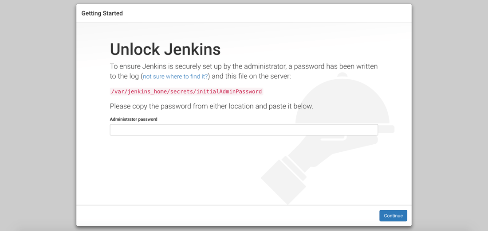
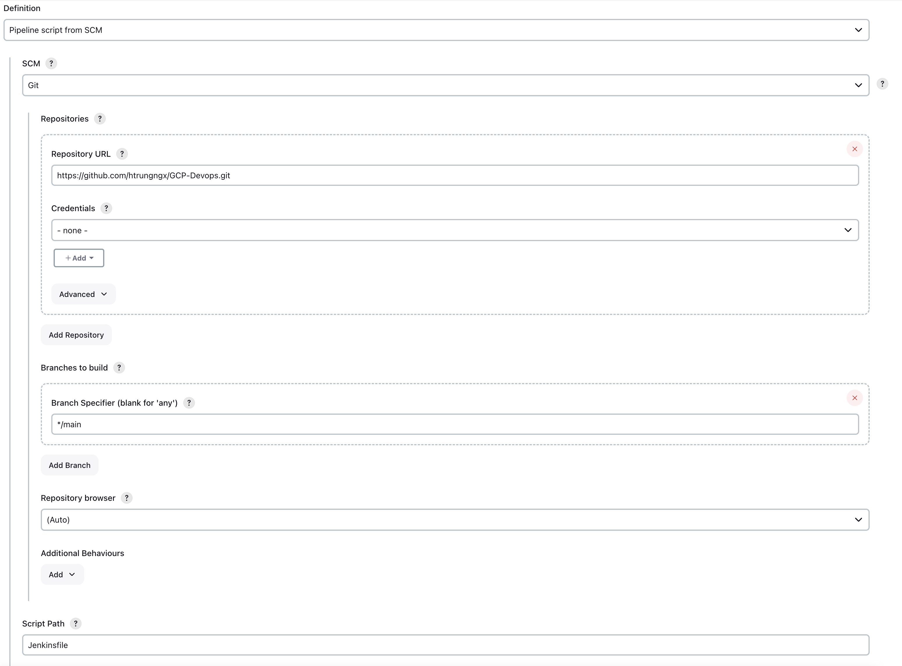
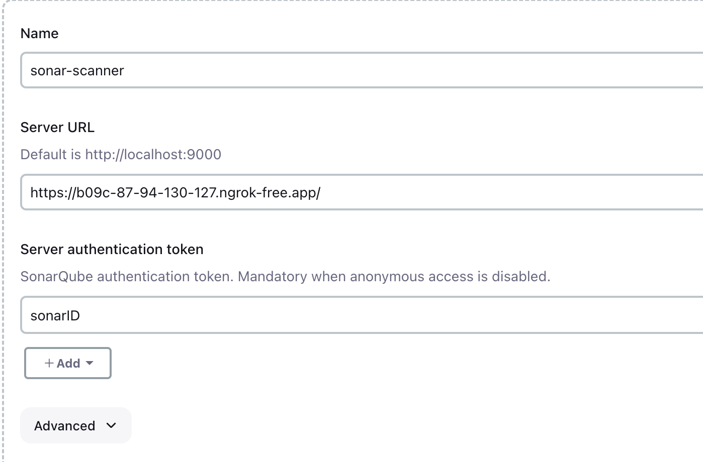

# DEVOPS/GITOPS PROJECT

## Clone 
```
git pull https://github.com/htrungngx/GCP-Devops.git
cd GCP-Devops
```
## Run on local

```
npm install
npm start
```


# CI/CD pipeline for todo application
# Diagram 


# Setting up 
## Pipeline 1 (Job 1)
Host Jenkins on a Azure EC2 VM with the following requirements 

    - Standard B2s machine type
    - Create subnet and config static public IP 
    - Ubuntu 20.04 LTS GEN 2
    - Open port 80, 443, 3000, 9000


Install Jenkins via Docker in Docker 
```
    git clone https://github.com/htrungngx/Jenkins-nginx-compose.git 
    cd Jenkins-nginx-compose 
    sudo ./startup-docker.sh 
    cd jenkins && docker-compose up -d
```

Access Jenkins
>http://jenkin-VM-IPadd

Unlock Jenkins requires password which is stored inside Docker container


>docker ps -a #Find jenkins's container id

>docker exec -it 'jenkins container id' /bin/bash 

>cat /var/jenkins_home/secrets/initialAdminPassword

Follow steps to install required plugins

- Create pipeline named "Jenkins-pipeline"
- Under job's configuration, select "Github hook trigger for GITScm polling" and trigger from Jenkinsfile
- Create webhook under your repo: http://jenkins-ip/github-webhook/

    

- Install required plugins: Sonarqube, NodeJS, OWASP Dependency

1. SonarQube

    >http://sonarqube-ip:9000/ 
    - Login with default credential and, create project ('testing-project') create token, setup Jenkins webhook

    >http://jenkins-ip/sonarqube-webhook/


    Manage Jenkins > System > SonarQube servers
    - Name: sonar-scanner
    - ServerURL: https://sonarqube-ip
    - Save sonarqube's token in Jenkins as a secret text named "sonarID"

    I host Sonarqube as a container in local host + forwarding using ngrok 

    
    
2. NodeJS 

    Manage Jenkins > Tools > NodeJS Installation 

    >Name: nodejs

    >Version: any

    >npm install -g

3. OWASP 

    Manage Jenkins > Tools > Dependency-Check installations

    >Name: dp-check

- Define variables 

 Manage Jenkins > System > Global properties > Environment variables

## Pipeline 2 (job 2)

Follow [this](https://github.com/htrungngx/gitops-project) to create infrastructure (ArgoCD + Kubernetes)

[Deployment_repo](https://github.com/htrungngx/ArgoCD_Deployments)

On Jenkins server, create job 2

>Name: Argo_Deployment

>Type: pipeline

Configuration > This project is parameterized 

>String: DOCKERTAG

>Value: env.BUILD_NUMBER

Configuration > Pipeline > Specify repo URL above, branch 'main', Scriptpath 'Jenkinsfile'

## Setup ArgoCD 

